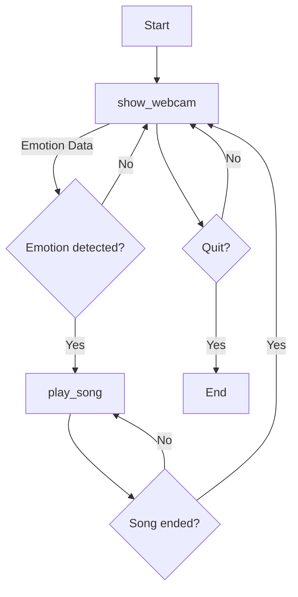

# EmotionSong

## Installation

```bash
git clone https://github.com/marshmeowllo/CEDT.git Project114
cd Project114
```


```mermaid
graph TD
    A[Start] --> B[show_webcam]
    B --> |Emotion Data| C{Emotion detected?}
    C -- Yes --> D[play_song]
    C -- No --> B
    D --> E{Song ended?}
    E -- No --> D
    E -- Yes --> B
    B --> F{Quit?}
    F -- No --> B
    F -- Yes --> G[End]
```